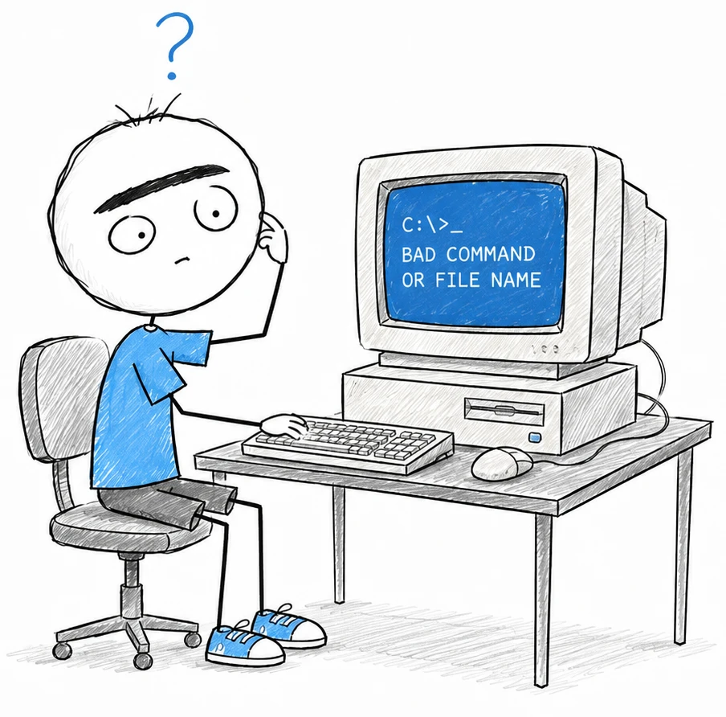

# semantic-review

> Tell me that again but _slowly_...

Semantic diff review for coding agents.

An LLM reads a git diff and reorganizes it into a **narrative HTML report** — grouped by concern, not alphabetically, with the interesting excerpts inline, highlighted and commentable. When the reviewer clicks **Done**, their comments print to `stdout` as plaintext for the agent that invoked it.

```
agent runs `semantic-review` ──► LLM analyzes the diff ──► browser opens the report
agent reads stdout ◄── plaintext feedback ◄── human comments, clicks Done
```

Requires Node >= 20 (or [Bun](https://bun.sh)) and one backend: `ANTHROPIC_API_KEY`, or an installed `claude`, `codex`, `gemini`, or `pi` CLI.

```sh
npx semantic-review
```


Run it like `$ git diff`:

```
semantic-review                        # review uncommitted changes
semantic-review main...HEAD            # review a branch
git diff -U10 | semantic-review        # review any piped diff
semantic-review --with anthropic,codex # one analysis per backend, tabbed
semantic-review --model claude-sonnet-5 --effort medium
```

Tell your agent (`CLAUDE.md`, `AGENTS.md`, …):

> After completing a substantial change, run `npx semantic-review` and wait for it to exit. Its stdout is the user's review feedback — treat each comment as a change request and address it.
